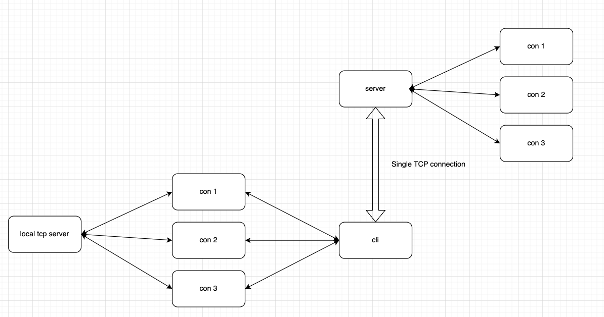

# Tcproxy

Project name is a tool that allows port forwarding to your local machine, even behind firewall.

## Prerequisites

Before you begin, ensure you have met the following requirements:
- Rust 1.67 or later

## How it works
The project is split into two parts, the server, and a client, whenever a new client
connects to the server, the server spawns a new listening port, in which all traffic 
will be routed to the client.
The server uses a single TCP connection, multiplexing all traffic being forwarded to 
the connected client.

The following diagram shows a local TCP server (REST api, local db instance, etc..)
that receives forwarded traffic from the remote (random) port on the server



## Using Tcproxy Server

To spawn  ```tcproxy-server```, follow these steps:

To see all options:
```
> tcproxy-server --help

With Cargo:
> cargo run --bin tcproxy-server -- --help
```

Starting the server listening on port 8080

```
> tcproxy --port 8080

With Cargo:
> cargo run --bin tcproxy-server -- --port 8080
```

Starting the server with a different port range available for proxy servers (default is from 15000-25000)
```
> tcproxy --port 8080

With Cargo:
> cargo run --bin tcproxy-server -- --port 8080
```


## Contributing to <project_name>
To contribute to this project, follow these steps:

1. Fork this repository.
2. Create a branch: `git checkout -b <branch_name>`.
3. Make your changes and commit them: `git commit -m '<commit_message>'`
4. Push to the original branch: `git push origin <project_name>/<location>`
5. Create the pull request.

Alternatively see the GitHub documentation on [creating a pull request](https://help.github.com/en/github/collaborating-with-issues-and-pull-requests/creating-a-pull-request).

## Contributors

Thanks to the following people who have contributed to this project:

* [@m4urici0gm](https://github.com/m4urici0gm) 📖

## Contact

If you want to contact me you can reach me at contact@mgbarbosa.dev

## License
<!--- If you're not sure which open license to use see https://choosealicense.com/--->

This project uses the following license: [GPL-2.0](https://github.com/M4urici0GM/tcproxy/blob/main/LICENSE.md).